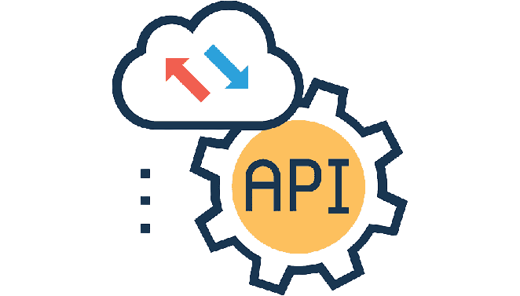
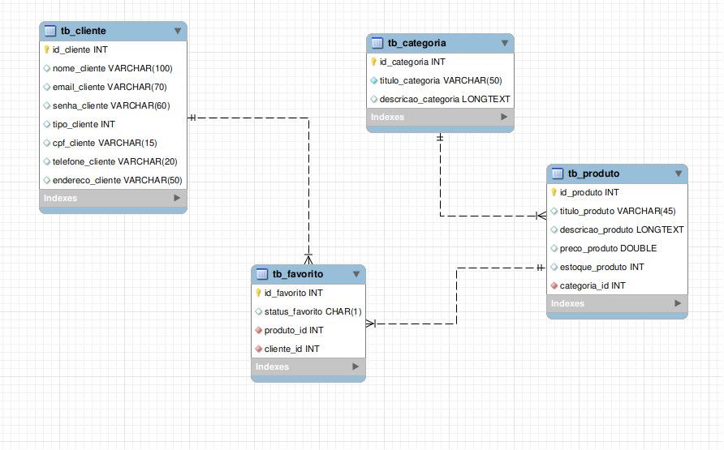

<p align="center">
   
</p>

<p align="center">
   
    
    
    
    
    
</p>

### Sobre o projeto

O sistema gerenciador de produtos, categorias e clientes (Visualização | Postagem | Atualização | Remoção). Para acessar sua parte front-end é necessário autenticação através do cliente
<hr>
<i>Esse front-end não tem controle de tipo usuário, ou seja, qualquer pessoa pode realizar operações administrativa (o sistema foi pensado diretamente no desenvolvimento do CRUD, e não segurança)</i>

### MER - Modelo de Entidade Relacional



### API - Icone Virtual

#### Autenticação

<b style="color:#198754">POST - Login</b>

```bash
http://localhost:porta/login
```

Vai ser gerado um token de autenticação - Express JWT

#### Cliente

<b style="color:#6f42c1">GET - Listagem produto</b>

```bash
http://localhost:porta/cliente
```


<b style="color:#6f42c1">GET - Listagem produto selecionado</b>

```bash
http://localhost:porta/cliente/1
```

<b style="color:#6f42c1">GET - Cliente Logado</b>

```bash
http://localhost:porta/usuario-logado
```

<b style="color:#198754">POST - Postar Cliente</b>

```bash
http://localhost:porta/cliente
```

<b style="color:#fd7e14">PUT - Atualizar Cliente</b>

```bash
http://localhost:porta/cliente/1
```

<b style="color:#dc3545">DELETE - Remover Cliente</b>

```bash
http://localhost:porta/cliente/1
```

#### Categoria

<b style="color:#6f42c1">GET - Listagem</b>

```bash
http://localhost:porta/categoria
```

<b style="color:#6f42c1">GET - Listagem da categoria</b>

```bash
http://localhost:porta/categoria/1
```

<b style="color:#198754">POST - Postar Categoria</b>

```bash
http://localhost:porta/categoria
```

<b style="color:#fd7e14">PUT - Atualizar Categoria</b>

```bash
http://localhost:porta/categoria/1
```

<b style="color:#dc3545">DELETE - Remover Categoria</b>

```bash
http://localhost:porta/categoria/1
```

#### Produto

<b style="color:#6f42c1">GET - Listagem</b>

```bash
http://localhost:porta/produto
```

<b style="color:#6f42c1">GET - Listagem da produto</b>

```bash
http://localhost:porta/produto/1
```

<b style="color:#198754">POST - Postar Produto</b>

```bash
http://localhost:porta/produto
```

<b style="color:#fd7e14">PUT - Atualizar Produto</b>

```bash
http://localhost:porta/produto/1
```

<b style="color:#dc3545">DELETE - Remover Produto</b>

```bash
http://localhost:porta/produto/1
```

#### Favorito

<b style="color:#6f42c1">GET - Listagem</b>

```bash
http://localhost:porta/favorito
```

<b style="color:#198754">POST - Postar Favorito</b>

```bash
http://localhost:porta/favorito
```

<b style="color:#dc3545">DELETE - Remover Favorito</b>

```bash
http://localhost:porta/favorito/1
```

<i>Todas as solicitações acima precisam de token, ou seja, bearer token para que possam ser acessadas</i>


### Funcionalidades

- [x] Ambiente Back-end - API
  - [x] Configs
  - [x] Controllers
  - [x] Databases
  - [x] Middlewares
  - [x] Models
  - [x] Routers
  - [x] Env - Proteção de dados sigilosos

### Layout

O layout da aplicação da aplicação está disponível abaixo:

<div>
    <table>
      <thead>
        <tr>
           <th>
              
           </th>
        </tr>
      </thead>
      <tbody>
      </tbody>
    </table>
</div>

### 🚀 Como executar o projeto

Este projeto é dividido em três partes:

<ul>
   <li>Construção banco de dados | rotas | servidor</li>
   <li>Integração dos models | controllers | configs</li>
   <li>Integração do middleware de acesso as dados de requisição</li>
</ul>

💡 Aplicação back-end construida com Nodejs | ExpressJs | Sequelize, ou seja, desenvolvida apenas para o servidor e não para aplicabilidade web.

#### Pré-requisitos

Antes de começar, você vai precisar ter instalado em sua máquina as seguintes ferramentas: [Git](https://git-scm.com/), [Node.js](https://nodejs.org/en/). Alem disto é bom ter um editor para trabalhar com o código como [VSCode](https://code.visualstudio.com/).

##### 🧭 Rodando a aplicação web - React

```bash

# Clone este repositório
$ git clone https://github.com/MateusMaciel340/api-icone-virtual.git

# Acesse a pasta do projeto no terminal/cmd - React
$ cd api-icone-virtual/

# Instale as dependências
$ npm install

# Você pode configurar isso em Scripts
$ npm run dev

```

💡 Atenção: o projeto possui uma configuração do dotenv, ou seja, existe campos que contém o determinado código: 

```bash
# Acesso na porta
process.env.PORT
```

<i>Eu tenho um arquivo chamado .env, onde está armazenando variáveis de ambiente, que estão listados em ".env.example"</i>

💡 O que você tem que fazer?

Copiar ".env.example" e criar um arquivo ".env" e mudar os campos de acordo com as necessidades da sua máquina.

### 🛠 Tecnologias

As seguintes ferramentas foram usadas na construção do projeto:

<b>Back-end ([Nodejs](https://nodejs.org/en/))</b>

<ul>
   <li>Nodejs</li>
   <li>Express.js</li>
   <li>Sequelize</li>
   <li>MySQL</li>
   <li>Módulos gerais do Node Modules</li>
</ul>

### 👨‍ Contribuidores

<div>
    <table>
      <thead>
        <tr>
           <th>
              
           </th>
        </tr>
      </thead>
      <tbody  align="center">
           <td>
             Mateus Maciel
           </td>
      </tbody>
    </table>
</div>

### 💪 Como contribuir para o projeto

1. Faça um **fork** do projeto.
2. Crie uma nova branch com as suas alterações: `git checkout -b feature/cliente`
3. Salve as alterações e crie uma mensagem de commit contando o que você fez: `git commit -m "Organizando as linhas de código da função delete cliente"`
4. Envie as suas alterações: `git push origin feature/cliente`

### 📝 Licença

Este projeto esta sobe a licença [MIT](https://github.com/nodejs/node/blob/master/LICENSE).